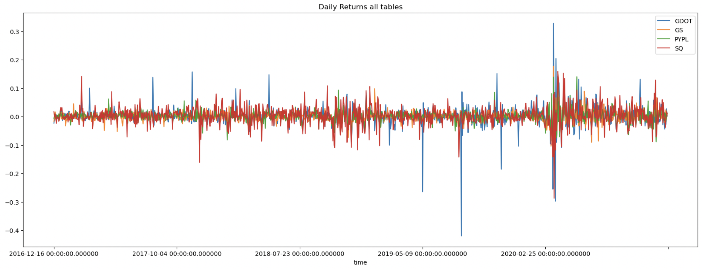

# **Columbia University Engineering, New York FinTech BootCamp** 
# **August 2022 Cohort**
## *Passive Investing exchange-traded fund (ETF)* 

Objective - to script a financial database and web application using SQL, Python, and the Voilà library to analyze the performance of a hypothetical FinTech ETF. 

Beyond the scope of the assignment, the author sought to conduct additional refinement and/or analysis of the data obtained and demonstrate further visualization....  Supplemental and/or extra analysis beyond the scope of the project is noted as 'supplemental' were approrpiate. 

---


## **Methods**
### The code script analysis performed:
    
#### Step I - Analyze a single asset in the FinTech ETF, provide visualization


#### Step I - Supplementals analyze all individual assets in the FinTech ETF, provide visualization




#### Step II - Optimize the SQL Queries, analyze the ETF overall cumulative performance, provide visualization


#### Final Voila Images 


---
## **Technologies**
---
### **Dependencies**

This project leverages Jupyter Lab v3.4.4 and python v3.7 with the following packages:

* [numpy](https://numpy.org/doc/stable/) - Software library, NumPy is the fundamental package for scientific computing in Python, provides vast functionality.

* [pandas](https://pandas.pydata.org/docs/) - Software library written for the python programming language for data manipulation and analysis.

* [read_sql_query](https://pandas.pydata.org/docs/reference/api/pandas.read_sql_query.html) - From 'pandas', read SQL query into a DataFrame; returns a DataFrame corresponding to the result set of the SQL query string.

* [concat](https://pandas.pydata.org/docs/reference/api/pandas.concat.html) - From 'pandas', concatenate pandas objects along a particular axis, allows optional set logic along the other axes.

* [hvplot](https://hvplot.holoviz.org/user_guide/Introduction.html) - provides a high-level plotting API built on HoloViews that provides a general and consistent API for plotting data into numerous formats listed within linked documentation.

* [SQLAlchemy](https://www.sqlalchemy.org/) - the Python SQL toolkit and Object Relational Mapper that gives application developers the full power and flexibility of SQL.

* [Engine](https://docs.sqlalchemy.org/en/14/core/engines.html) - From 'SQLAlchemy', the starting point for any SQLAlchemy application; creates a tailored Dialect object, as well as a Pool object which will establish a DBAPI connection.

* [Inspection](https://docs.sqlalchemy.org/en/14/core/inspection.html) - From 'SQLAlchemy', inspection module provides the inspect() function, which delivers runtime information about a wide variety of SQLAlchemy objects, both within the Core as well as the ORM.


### **Hardware used for development**

MacBook Pro (16-inch, 2021)

    Chip Appple M1 Max
    macOS Monterey version 12.6

### **Development Software**

Homebrew 3.5.10

    Homebrew/homebrew-core (git revision 0b6b6d9004e; last commit 2022-08-30)
    Homebrew/homebrew-cask (git revision 63ae652861; last commit 2022-08-30)

anaconda Command line client 1.11.0

    conda 22.9.0
    Python 3.9.13

pip 22.2.2 from /opt/anaconda3/envs/jupyterlab_env/lib/python3.9/site-packages/pip (python 3.9)


git version 2.37.2

---
## *Installation of application (i.e. github clone)*

 In the terminal, navigate to directory where you want to install this application from the repository and enter the following command

```python
git clone git@github.com:Billie-LS/snaking_fintech_etf.git
```

---
## **Usage**

From terminal, the installed application is run through jupyter lab web-based interactive development environment (IDE) interface by typing at prompt:

```python
  > jupyter lab
```

The file you will run is:

```python
  etf_analyzer.ipynb
```

---
## **Project requirements**
### see starter code

---
## **Version control**

Version control can be reviewed at:

[repository](https://github.com/Billie-LS/Proptech_analysis_and_visualization)


---
## **Contributors**

### **Author**

Loki 'billie' Skylizard
    [LinkedIn](https://www.linkedin.com/in/l-s-6a0316244)
    [@GitHub](https://github.com/Billie-LS)


### **BootCamp lead instructor**

Vinicio De Sola
    [LinkedIn](https://www.linkedin.com/in/vinicio-desola-jr86/)
    [@GitHub](https://github.com/penpen86)


### **BootCamp teaching assistants**

Santiago Pedemonte
    [LinkedIn](https://www.linkedin.com/in/s-pedemonte/)
    [@GitHub](https://github.com/Santiago-Pedemonte)


### **BootCamp classmates**

Stratis Gavnoudias
    [LinkedIn](https://www.linkedin.com/in/stratis-gavnoudias-465b527/)
    [@GitHub](https://github.com/sgavnoudias)

___

### **Other Reference Sources**

SQLAlchemy [PYSHEET](https://www.pythonsheets.com/notes/python-sqlalchemy.html)

set dataframe index [pandas](https://pandas.pydata.org/docs/reference/api/pandas.DataFrame.set_index.html)

pandas.DataFrame.to_sql [pandas](https://pandas.pydata.org/docs/reference/api/pandas.DataFrame.to_sql.html#pandas-dataframe-to-sql)

inner joins [W3 schools](https://www.w3schools.com/sql/sql_join_inner.asp)

annualized returns [datacamp](https://campus.datacamp.com/courses/introduction-to-portfolio-analysis-in-python/risk-and-return?ex=1)

add an empty column to a dataframe [stack_overflow](https://stackoverflow.com/questions/16327055/how-to-add-an-empty-column-to-a-dataframe)

---
## **License**

MIT License

Copyright (c) [2022] [Loki 'billie' Skylizard]

Permission is hereby granted, free of charge, to any person obtaining a copy
of this software and associated documentation files (the "Software"), to deal
in the Software without restriction, including without limitation the rights
to use, copy, modify, merge, publish, distribute, sublicense, and/or sell
copies of the Software, and to permit persons to whom the Software is
furnished to do so, subject to the following conditions:

The above copyright notice and this permission notice shall be included in all
copies or substantial portions of the Software.

THE SOFTWARE IS PROVIDED "AS IS", WITHOUT WARRANTY OF ANY KIND, EXPRESS OR
IMPLIED, INCLUDING BUT NOT LIMITED TO THE WARRANTIES OF MERCHANTABILITY,
FITNESS FOR A PARTICULAR PURPOSE AND NONINFRINGEMENT. IN NO EVENT SHALL THE
AUTHORS OR COPYRIGHT HOLDERS BE LIABLE FOR ANY CLAIM, DAMAGES OR OTHER
LIABILITY, WHETHER IN AN ACTION OF CONTRACT, TORT OR OTHERWISE, ARISING FROM,
OUT OF OR IN CONNECTION WITH THE SOFTWARE OR THE USE OR OTHER DEALINGS IN THE
SOFTWARE.


